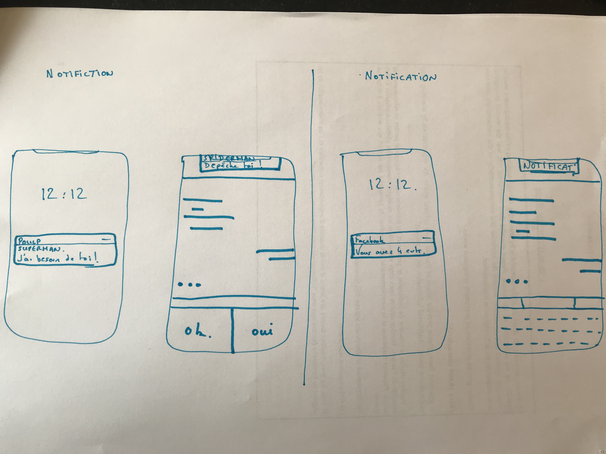
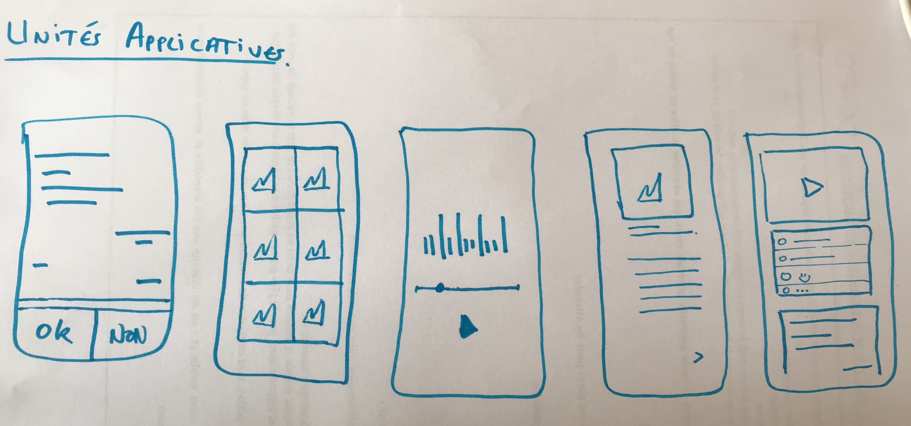
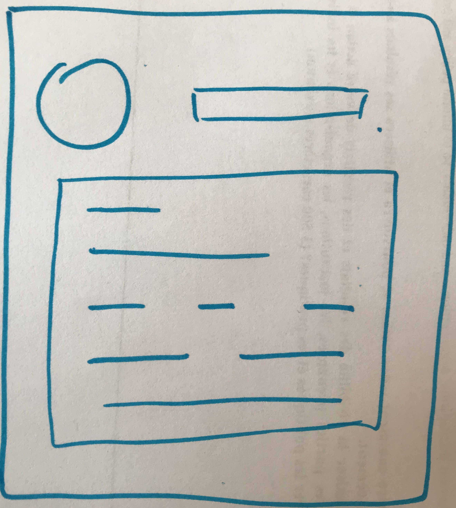
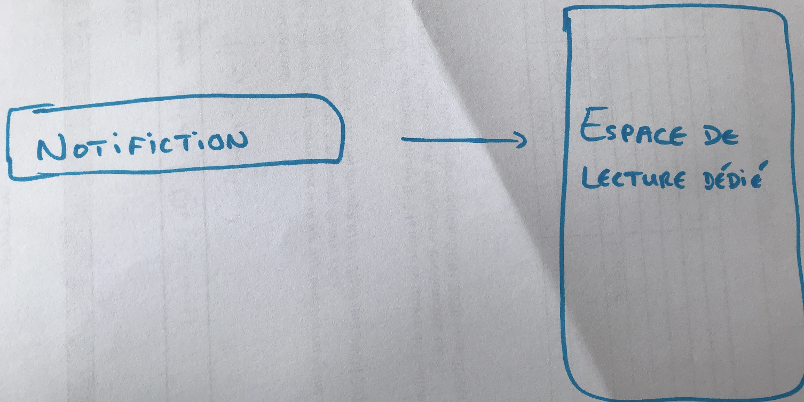
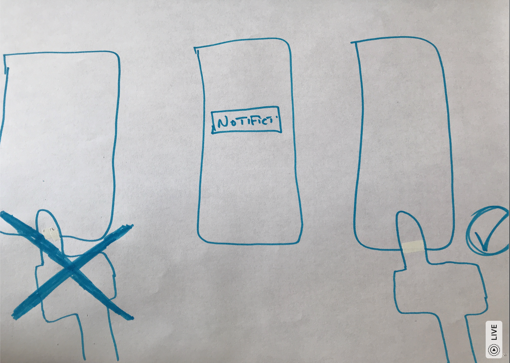
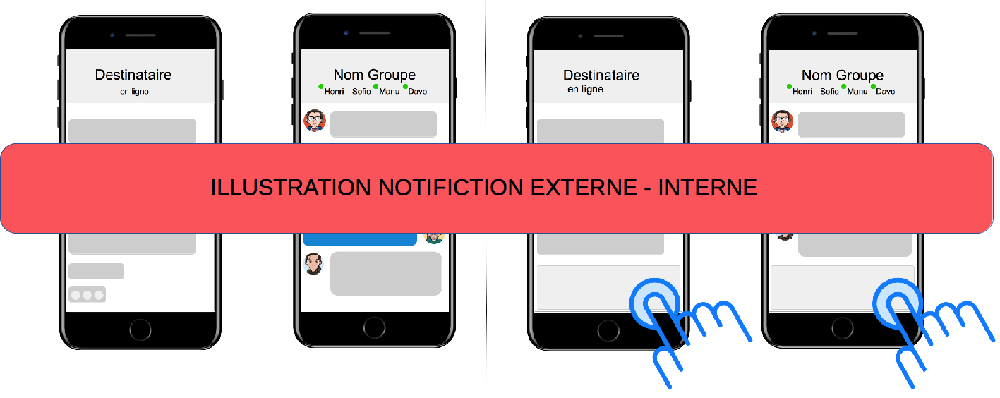
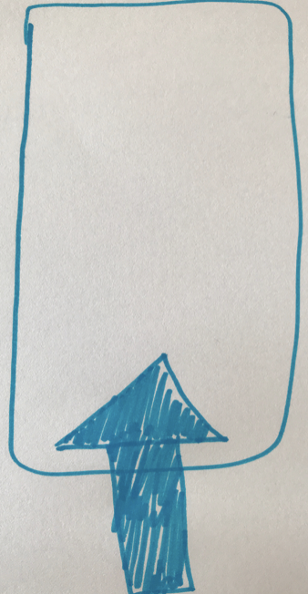
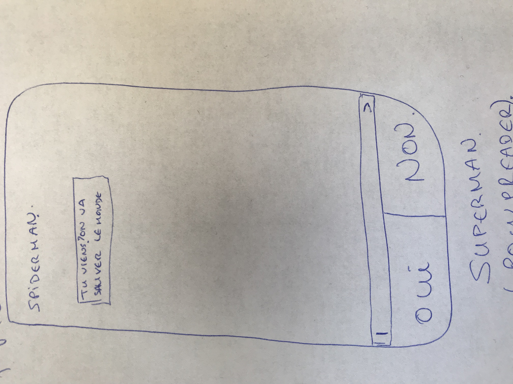
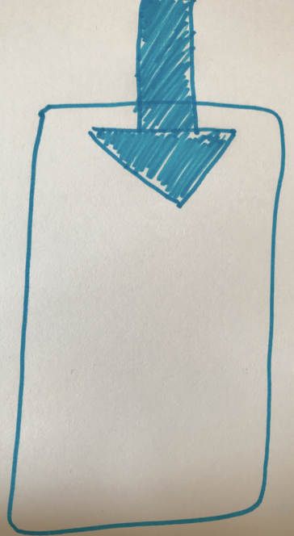

# Bons Usages

## Les bons usages de PoulpStudio 

En bon petits Poulps que nous sommes, nous vous avons concocté une petite encyclopédie poulpienne que vous pourrez transmettre de parents en enfants pour raconter les différents récits de l'humanité ! 😜Bon, après si vous ne souhaitez pas raconter l'histoire de l'humanité, vous pouvez aussi lire ce petit guide pour vous accompagner dans la production de l'histoire que vous souhaitez partager avec d'autres personnes que votre grand-mère, par exemple. En plus, le temps qu'elle comprenne comment fonctionne un smartphone... alors si elle doit capter que l'histoire est diffusée sur smartphone, vous n'avez pas fini...  Bref, ne divergeons pas ! Un monde est à construire 🚧🏗

**C'est parti pour le jingle :** 

 🎙Avec PoulpStudio, créez des [smartfictions](dico-du-poulp.md#smartfiction) interactives, multijoueur ! [_PoulpReaders_](dico-du-poulp.md#poulpreader)  définissent leur propre parcours de lecture en sélectionnant tel ou tel choix de scénario. Diffusée sur smartphone, _PoulpReader_ parcourt l'histoire et progresse dans sa lecture au rythme des [_notifictions_ ](dico-du-poulp.md#notifiction)reçues. 🎙

**Qu'est-ce qu'une** _**notifiction**_ **@PoulpWik 🎓 ?** 

Parlons sérieusement un moment ou plus justement, parlons solennellement, le coeur sur la main \(un peu à la Bernard Pivot\) : 

📚La _notifiction_ est ce qui fait événement dans votre histoire ! La _notifiction_ est la contraction de deux termes : "notification" et de "fiction". Techniquement, la _notifiction_ a les mêmes propriétés qu’une notification mais son emploi n’est pas le même. La notifcation fait événement dans mon smartphone. Elle me rappelle les différents événements que j'ai programmés ou auxquels je me suis inscrit.e. La _notifiction_ quant à elle, __fait événement au sein de l'histoire à laquelle le lecteur/joueur s'est abonnée. Elle balise les différentes étapes de l'histoire et participe à la mise en intrigue de l'histoire. Elle permet de rediriger le/la _PoulpReader_ dans l’espace de lecture que vous, [PoulpBuilder](dico-du-poulp.md#poulpbuilder), souhaitez. 📚

### Avec PoulpStudio : 

* production d’un scénario complexe
* conditionnalité
* choix multiple
* mode multijoueur
* bonus
* notifiction

Diffusée sur smartphone, l'histoire jouée au sein de la smartfiction est semblable \(en terme de design\) au design d'interface et de navigation d'un smartphone. Réalisée à partir de modèles d’applications similaires à celles présentes et utilisées au sein d’un smartphone, la construction d'un univers de fiction repose sur la mobilisation des différentes unités applicatives disponibles.

L'univers de fiction étant construit à partir de ces différentes unités applicatives \(applications - ici - fictives\), ci-suit une liste reprenant les différents usages qu’un utilisateur de smartphone effectuent au quotidien. Cette indexation est une liste non exhaustive des différentes ré-appropriations d'usages dans un contexte de production de fictions jouées sur smartphone.  

**INDEXATION DES USAGES NUMÉRIQUES D'UN SMARTPHONE :** 

| **Communiquer** |
| :---: |
| appeler et recevoir des appels téléphoniques |
| envoyer et recevoir des messages  |
| émettre un post et/ou un commentaire sur un réseau social  |

| S'enregistrer |
| :---: |
| prendre des photos |
| prendre des vidéos |
| enregistrement audio  |

| Répertorier |
| :---: |
| contacts  |
| photographies |
| vidéographies |

| Gérer |
| :---: |
| calendrier |
| réveil |
| application de santé  |
| administration  |

| S'informer |
| :---: |
| application dédiée à l'information \(magazine ou journal au format applicatif\) |
| poadcast |

| Se Divertir |
| :---: |
| jeux vidéo |
| récits interactifs |
| musique |
| vidéos \(films, séries, clips, etc.\) |

| Consommer |
| :---: |
| acheter |

| S'Orienter |
| :---: |
| GPS |
| système de géolocalisation  |

| Actualiser |
| :---: |
| renouveler... |
| augmenter... |
| actualiser... le contenu de son smartphone \(paramètre de configuration ou appStore/GooglePlay |

Ces usages relèvent de ce que l'on appelle des "pratiques ordinaires".  Elles sont le théâtre de la smartfiction. Il faut jouer avec le support de diffusion qu'est le smartphone. Sinon, pourquoi utiliser ce support de diffusion ?  Bande de PoulpBuilders, vous devez vous poser les questions : Qu'est ce que cela m'apporte de construire une histoire à partir de l'outil smartphone ? Qu'est-ce que ça motive dans l'écriture d'une fiction, le fait de construire une histoire pour qu'elle soit lue sur smartphone ? Comment l'histoire \(en terme de structuration, de construction\) est reçue par les PoulpReaders ? Pour l'ensemble de ces questions, quelques éléments de réponse...

## LA CRÉATION D'UNE SMARTFICTION 

La smartfiction repose sur la création de trois éléments : personnage, environnement de jeu et _notifiction._ C'est parti pour un tour du propriétaire des éléments dont vous avez besoin pour construire le monde fictif que vous souhaitez partager avec les PoulpReaders. 👀

### Le personnage

La création de votre personnage est la création d’une identité fictive que vous devez faire évoluer dans l’histoire.

La création d'un personnage commence avec la création de son identité. Elle se fait par l’inscription d’un pseudo, d'un nom, d'un prénom, d’une représentation graphique \(photo de profil, par exemple\), de son âge et d’une brève description. 

Une fois les différents champs d'informations remplis, validez la création de votre personnage ! Attention, veillez à déterminer si votre personnage est Personnage Joueur ou Personnage Non Joueur, cela a un impact sur la construction et la réception de votre histoire. 

Si le personnage est \[Personnage Joueur\], cela signifie que PoulpReader incarne le rôle du personnage et c'est via ce personnage que PoulpReader accède à la smartfiction. Il visite le monde fictif à la première personne.  

Si le personnage est \[Personnage Non Joueur\] cela signifie que le personnage n'est pas incarné par PoulReader. Il est un personnage participant à la construction et à la dynamique de l'histoire. Il peut être également interlocuteur du \[Personnage Joueur\]. 

Une fois que avez veillé à remplir l'ensemble des informations concernant votre personnage et statué en tant que \[Personnage Joueur\] ou \[Personnage Non Joueur\], vous êtes prêt le mettre  en jeu dans les différents espaces applicatifs fictifs dédiées. 🙌

🎁**Le petit + ;-\)** 

Construit au sein d'un environnement numérique, les petits poulps qui ont construits PoulpStudio ont pensé à vous PoulpBuilders !  Grâce à l'inscription de votre personnage via un pseudo \(exemple : @Pseudoduperso\) ce petit bijou de la technologie vous permet de l'identifier au sein de l'ensemble de l'environnement de vie virtuelle. Cette identification facilite la création de _fanfiction_ pour que les PoulpReaders puissent à leur tour mettre en jeu le personnage que vous avez créé. Les PoulpReaders pourront également documenter ou commenter votre personnage au sein des diverses discussions entretenues entre eux, faisant vivre votre personnage en dehors de la smartfiction. 

### L'environnement de jeu 

Pour construire l'environnement de jeu, vous avez à votre disposition différents modèles d'application fictives. Ces différents modèles sont :

| Modèles Applicatifs |
| :---: |
| discussions instantanées |
| match or not  |
| article |
| feed |
| playlist |
| album photo  |
| vidéo |

Chaque modèle d'application met en jeu une séquence. C’est en utilisant ces différents modèles d’environnement de jeu que vous créez votre histoire en y faisant évoluer vos personnages.  

### La notifiction 

La _notifiction_ a la mission d'accomplir deux rôles dans votre histoire ! 

Elle est le super outil permettant de rediriger PoulpReader dans l'espace de lecture dédié. 

Elle est également celle qui permet au PoulpReader de pouvoir lire/jouer à nouveau.  

La notifiction comprend deux modes de jeu : la **notifiction externe** et la **notifiction interne**. 

Rien de compliqué, juste une petite distinction terminologique \(attention, mot de plus de 2 syllabes 🤯\) qui nous permet d'être plus pertinent dans la construction, structuration d'une histoire. 

La **notifiction externe** est utilisée pour inviter PoulpReader à revenir lire/jouer l'histoire. Il reçoit ce type de notif lorsqu'il a quitté la smartfiction. S'il a quitté la smartfiction, c'est parce qu'il n'y avait plus rien à lire à ce moment là, il faut donc informer PoulpReader qu'il y a de nouveau du contenu à lire et à joueur au sein de la smartfiction. Pour l'inciter à revenir lire/joueur, il est conseillé de lui envoyer une notifction externe. Nous l'appelons notifiction externe, puisque PoulpReader la reçoit alors qu'il n'est plus en train de lire/jouer l'histoire, il est externe à l'histoire. 

La **notifiction interne** permet de dynamiser l'histoire. Alors que PoulpReader est en train de lire tranquillement l'histoire que vous lui avez concocté  🚨BIM 🚨 une notifction s'affiche sur son écran de smartphone pour le rediriger dans un autre espace de lecture, dans une autre application fictive que vous avez mise en jeu. Effet de surprise garanti 😉. Nous l'appelons donc **notifiction interne** _****_ puisque PoulpReader la reçoit pendant son expérience de lecture, elle est interne à l'histoire.

## Statut de PoulpReader : Emetteur/Récepteur 

### Le lecteur/joueur comme émetteur de contenu :

Pour pouvoir progresser dans la lecture, PoulpReader doit interagir avec les éléments qui lui sont donnés à jouer. Valider des choix de lecture, répondre à des énigmes, envoyer des messages \(pré-écrits et scénarisés par vos soins, PoulpBuilder 🙃\)etc. PoulpReader est donc émetteur de contenus. Ce statut du lecteur/joueur est particulier et doit être pris en compte dès l'écriture de votre histoire ! Quelle est la place du lecteur/joueur ? Comment reçoit-il l'histoire ? Est-ce qu'il incarne le rôle d'un personnage ? Ces différentes questions sont le fil rouge de l'écriture de votre scénario. 

Par exemple, si PoulpReader lit une smartfiction de type [ChatStories](dico-du-poulp.md#chatstories) mettant en jeu un dialogue entre "Cendrillon" et "Blanche-Neige", PoulpReader incarnera "Blanche-Neige" pour recevoir les messages de "Cendrillon". Ainsi, dans la section "Personnages", vous devrez cocher "Personnage Joueur" concernant "Blanche-Neige pour que PoulpReader puisse incarner "Blanche-Neige".

### Le lecteur/joueur comme récepteur de contenu :

En tant que PoulpReader, le public reçoit votre histoire telle que vous \(PoulpBuilder\) l'imaginiez. Son statut de PoulpReader est remotivé lorsqu'il.elle reçoit une notifction de façon intrusive lors de son expérience de lecture ou pour le.la réinviter à rejoindre l'histoire qu'il ou elle avait précédemment quitté. 

## Jeux de langage

En contexte numérique, les jeux de langage repose sur une articulation des usages sociaux et de la scénarisation de l'histoire que vous souhaitez partagez avec vos lecture. Autrement dit, les jeux de langage révèlent les pratiques usuelles d'un usager numérique dans un contexte de production d'un projet artistique. 

* T9 
* langage sms 
* lapsus technologique --&gt; complicité avec le lecteur 
* lettres en capitales \(traduction d'une émotion en contexte\) 
* utilisation emoji pour scénariser une émotion, un état, une humeur. Complicité avec le lecteur. 
* utilisation des \# 

##  

