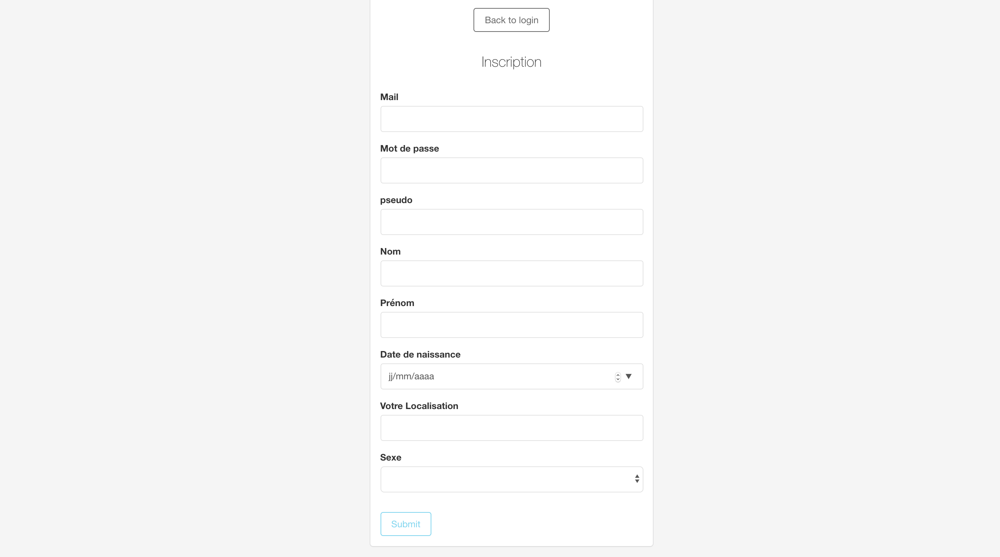
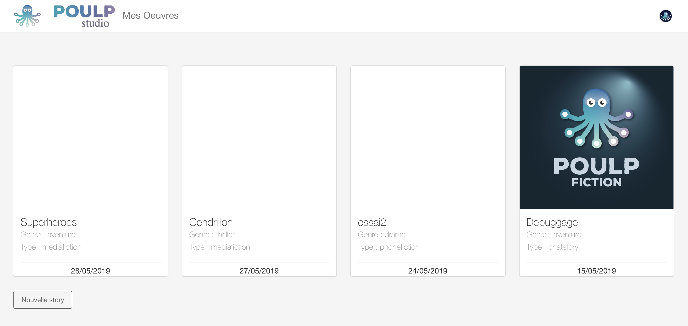

# First Step

## Gérer mon compte 

#### - étape 1 : connexion/inscription 

* **connexion**

Avant de construire ce monde de fiction, il faut d'abord que vous, PoulpBuilder, vous connectiez au sein de l'interface de connexion représentée ci-dessous : 

![capture d&apos;&#xE9;cran de l&apos;&#xE9;tape \[se connecter\]](.gitbook/assets/capture-de-cran-2019-06-17-a-10.56.34.png)

Rien de plus simple, il suffit de vous connecter avec votre adresse mail et le mot de passe que vous avez renseigné au préalable dans le formulaire d'inscription. 

![capture d&apos;&#xE9;cran de l&apos;&#xE9;tape \[se connecter\] \#2](.gitbook/assets/capture-de-cran-2019-06-17-a-10.57.08.png)

Une fois ces champs d'information remplis, vous pouvez vous connecter en cliquant sur le bouton \[Submit\]. Vous êtes alors redirigé au sein de l'interface d'accueil.

* **Inscription :**

Si vous vous ne vous êtes pas encore inscrit.e, cliquez sur \[inscrivez-vous\] et renseignez les champs suivants  comme illustré ci-dessous : 

L'inscription d'un pseudo permettra à la communauté Poulp de vous identifier rapidement et être visible au sein de ce réseau numérique. Cette visibilité permet de vous inviter à rejoindre une équipe de PoulpBuilder.

Une fois la connexion/inscription réalisée avec succès, vous accédez à l'interface d'accueil.

#### - étape 2 : accès à l'interface d'accueil 

En accédant à cette interface d'accueil, vous bénéficiez d'une [visibilité sur l'ensemble des productions](visibilite-sur-les-productions.md#tableau-de-bord-des-productions) en cours de création et celles publiées. 

En haut, à droite de l'interface d'accueil, vous pouvez accéder à votre compte personnel en cliquant sur votre avatar comme illustré ci-dessous. Vous y retrouverez les accès à votre **profil**, la **documentation** Poulp, **support** et le moyen de vous **déconnecter** de PoulpStudio. 

![capture d&apos;&#xE9;cran de \[mon compte\]](.gitbook/assets/capture-de-cran-2019-06-17-a-10.45.25.png)

Lorsque vous cliquez sur votre profil, vous retrouvez l'ensemble des informations que vous avez renseigné lors de votre inscription. Vous pouvez modifier une information au sein de cet espace. Pour valider les modification, cliquez sur \[submit\]. 

![capture d&apos;&#xE9;cran de \[mon profil\]](.gitbook/assets/capture-de-cran-2019-06-17-a-11.16.55.png)

Via votre compte, vous pouvez également être redirigé à au sein de l'espace \[documentation\] de Poulp. Cet espace s'ouvrira par défaut dans un nouvel onglet. 

#### - Documentation 

En cliquant sur \[documentation\], vous êtes redirigé au sein de la documentation de PoulpStudio. Si vous êtes ici, c'est que vous avez trouvé le lien 🙌. 

La dernière section composant votre profil est \[Support\].

#### - Support

En cliquant sur ce lien, vous accédez directement à votre boîte mail. Vous êtes immédiatement mis en contact avec les membres de la brigade de poulps 😉 Le/La Poulp le/la plus rapide vous répondra 💨. Vous pouvez posez toutes vos questions, suggestions et mots doux. 😘

## Créer un histoire

## Inviter des créateurs à mon œuvre

