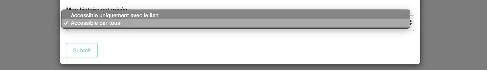
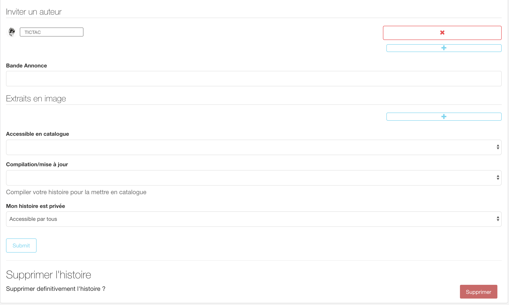

# First Step

## Gérer mon compte 

#### - étape 1 : connexion/inscription 

* **connexion**

Avant de construire ce monde de fiction, il faut d'abord que vous, PoulpBuilder, vous vous connectiez au sein de l'interface de connexion représentée ci-dessous : 

![capture d&apos;&#xE9;cran de l&apos;&#xE9;tape \[se connecter\]](.gitbook/assets/capture-de-cran-2019-06-17-a-10.56.34.png)

Rien de plus simple, il suffit de vous connecter avec votre adresse mail et le mot de passe que vous avez renseigné au préalable dans le formulaire d'inscription. 

![capture d&apos;&#xE9;cran de l&apos;&#xE9;tape \[se connecter\] \#2](.gitbook/assets/capture-de-cran-2019-06-17-a-10.57.08.png)

Une fois ces champs d'information remplis, vous pouvez vous connecter en cliquant sur le bouton \[Submit\]. Vous êtes alors redirigé.e au sein de l'interface d'accueil.

* **Inscription :**

Si vous vous ne vous êtes pas encore inscrit.e, cliquez sur \[inscrivez-vous\] et renseignez les champs suivants  comme illustré ci-dessous : 

L'inscription d'un pseudo permettra à la communauté Poulp de vous identifier rapidement. vous gagnerez en visibilité au sein de ce réseau numérique. Le pseudo facilite la démarche de vous inviter à rejoindre une équipe de PoulpBuilder.

Une fois la connexion/inscription réalisée avec succès, vous accédez à l'interface d'accueil.

#### - étape 2 : accès à l'interface d'accueil 

En accédant à cette interface d'accueil, vous bénéficiez d'une [visibilité sur l'ensemble des productions](visibilite-sur-les-productions.md#tableau-de-bord-des-productions) en cours de création et celles publiées. 

En haut, à droite de l'interface d'accueil, vous pouvez accéder à votre compte personnel en cliquant sur votre avatar comme illustré ci-dessous. Vous y retrouverez les accès à votre **profil**, la **documentation** Poulp, **support** et le moyen de vous **déconnecter** de PoulpStudio. 

![capture d&apos;&#xE9;cran de \[mon compte\]](.gitbook/assets/capture-de-cran-2019-06-17-a-10.45.25.png)

Lorsque vous cliquez sur votre profil, vous retrouvez l'ensemble des informations que vous avez renseigné lors de votre inscription. Vous pouvez modifier une information au sein de cet espace. Pour valider les modifications, cliquez sur **\[submit\]**. 

![capture d&apos;&#xE9;cran de \[mon profil\]](.gitbook/assets/capture-de-cran-2019-06-17-a-11.16.55.png)

Via votre compte, vous pouvez également être redirigé.e à au sein de l'espace **\[documentation\]** de Poulp. Cet espace s'ouvrira par défaut dans un nouvel onglet. 

#### - Documentation 

En cliquant sur \[documentation\], vous êtes redirigé.e au sein de la documentation de PoulpStudio. Si vous êtes ici, c'est que vous avez trouvé le lien 🙌. 

La dernière section composant votre profil est **\[Support\]**.

#### - Support

En cliquant sur ce lien, vous accédez directement à votre boîte mail. Vous êtes immédiatement mis en contact avec les membres de la brigade de Poulp 😉 Le/La Poulp le/la plus rapide vous répondra 💨. Partagez vos questions, suggestions et mots doux. 😘

...........................................PLACE À LA CRÉATION MAINTENANT...........................................

## Créer une histoire

Pour créer une histoire, cliquez sur **\[Nouvelle Story\]** en bas à gauche de l'interface d'accueil.

![capture d&apos;&#xE9;cran de l&apos;interface d&apos;accueil et de l&apos;acc&#xE8;s &#xE0; \[Nouvelle story\]](.gitbook/assets/capture-de-cran-2019-06-17-a-10.45.09.png)

Accédez à la fenêtre d'édition qu'il faut renseigner pour déterminer les premiers éléments de l'histoire comme illustré ci-dessous.

![capture d&apos;&#xE9;cran des champs &#xE0; remplir pour \[Nouvelle Story\]](.gitbook/assets/capture-de-cran-2019-06-17-a-11.47.39.png)

ATTENTION ! Si vous choisissez de restreindre le champ de visibilité de votre histoire au sein de votre équipe de création, sélectionnez **\[accessible uniquement avec le lien\]**. Si vous souhaitez que l'ensemble de votre équipe accède à l'histoire, sélectionnez \[accessible par tous\]. 

Une fois, les champs informationnels renseignée, cliquez sur **\[submit\]** et accédez à l'espace de création de l'oeuvre. Par défaut, s'affiche face à vous une fenêtre correspondant à la section **\[dashboard\]**. Comme l'illustre la capture d'écran ci-dessous. 

Face à vous, une fenêtre reprenant les premiers éléments d'informations que vous venez de renseigner. Vous pouvez compléter cette fenêtre en renseignant les champs suivants : 

C'est également au sein de cet espace que vous pouvez inviter des auteurs, constituer votre équipe.

Au sein du **\[menu\]** présent à gauche de votre écran, vous retrouves les différentes sections/outils vous permettant de construire votre histoire : 

* **\[story\]**
* **\[entity\]**
* **\[bibliothèque\]**

#### \*\*\*\*[**\[Story\]**](story.md#creer-mon-histoire-3-vues)\*\*\*\*

Au sein de cet espace de création, bénéficiez d'un outil qui va vous permettre de structurer votre histoire, d'écrire les différents contenus et de les connecter avec les différents éléments fictifs constituant votre histoire. 

#### \*\*\*\*[**\[Entity\]**](story.md#creer-les-entites-fictives)\*\*\*\*

Créez les personnages et objets fictifs nécessaires à la construction de votre histoire.

#### **\[Bibliothèque\]** 

Stockez l'ensemble des fichiers dont vous avez besoin pour que votre histoire prenne vie ! 

Au dessus, de ces différentes sections, vous retrouvez, le titre de votre oeuvre, sa photo de couverture et un lien d'accès à l'ensemble de vos oeuvres **\[mes oeuvres\]**. Notez que vous pouvez également accéder à votre profil via votre avatar situé en haut, à droite de l'interface.

## Inviter des créateurs à mon œuvre

La brigade du Poulp revient sur l'invitation des auteurs. 

Pour inviter un auteur, il faut que ce dernier s'inscrive à la plateforme PoulpStudio pour rejoindre la communauté PoulpBuilder. Ainsi, une fois inscrit.e, vous pouvez l'inviter au sein de la section **\[dashboard\]** \(comme illustré ci-dessus\) pour constituer votre équipe. Il vous suffit de rentrer le pseudo de l'auteur. Il recevra une notification l'informant de l'invitation, il l'accepte, il fait partie de l'équipe. À vous de collaborer ! 🙌

S'il ne l'accepte pas, il ne peux accéder à l'espace de création. 

