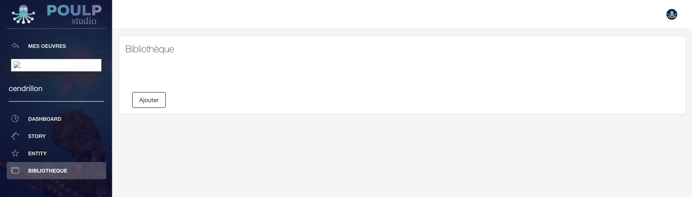
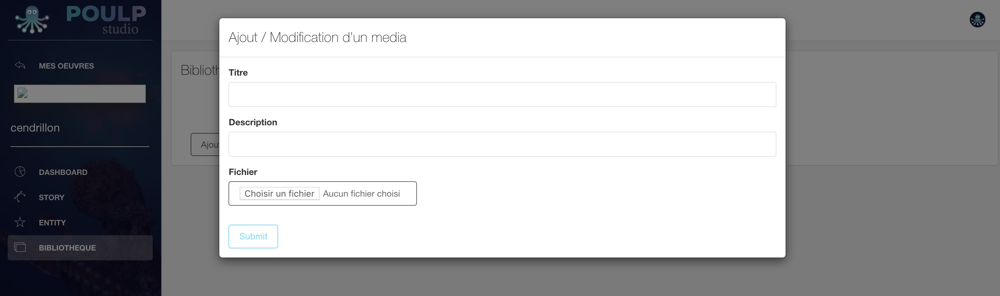
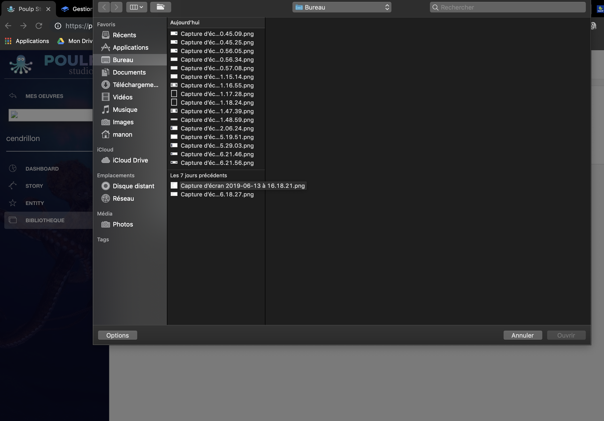

# Gestionnaires de fichiers

## Gérer les contenus 

Au sein de la section **\[Bibliothèque\]**, vous pouvez ajouter ou modifier des contenus \(médias\). 

Pour faire cette action, rien de plus simple !  

Allez dans la section **\[Bibliothèque\]**

Cliquez sur le contenu **\[Ajouter\]**

Pour une meilleurs indexation et visibilité de vos fichiers, il est conseillé de renseigner les champs \[titre\] , \[description\] et enfin, d'ajouter le fichier. \[Choisir le fichier\] vous reconduit automatiquement au sein de l'interface vous permettant de sélectionner les fichiers présents dans votre ordinateur \(image, son, vidéo\).

Une fois ces différents champs renseignés et fichier média sélectionné, il ne vous reste plus qu'à cliquer sur **\[submit\]** pour compiler le fichier dans votre bibliothèque média. Cette bibliothèque vous est réservé exclusivement pour le besoin de l'équipe dans le cadre de la production. Vous pouvez ajouter autant d'éléments médias que vous souhaité selon l'espace disponible indiqué lors de votre abonnement.  

À TITRE INDICATIF : 

* freemium 
* 
## Format des fichiersfichiers 

### Photo 

### Vidéo 

### Audio 

