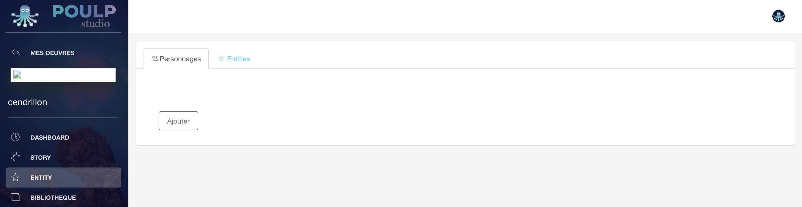
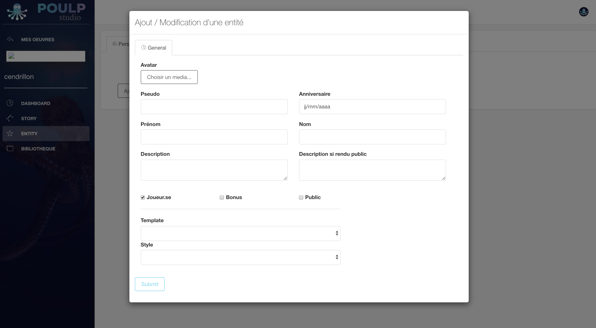
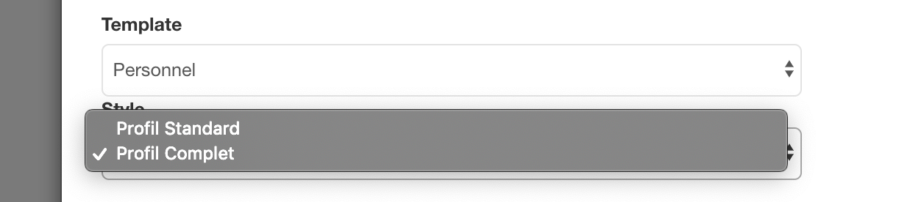
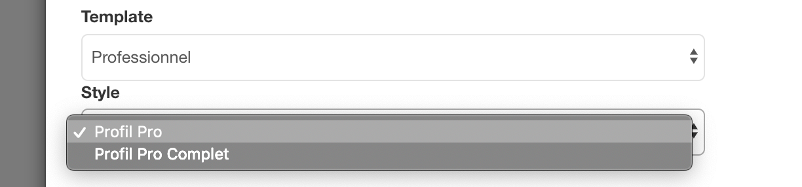
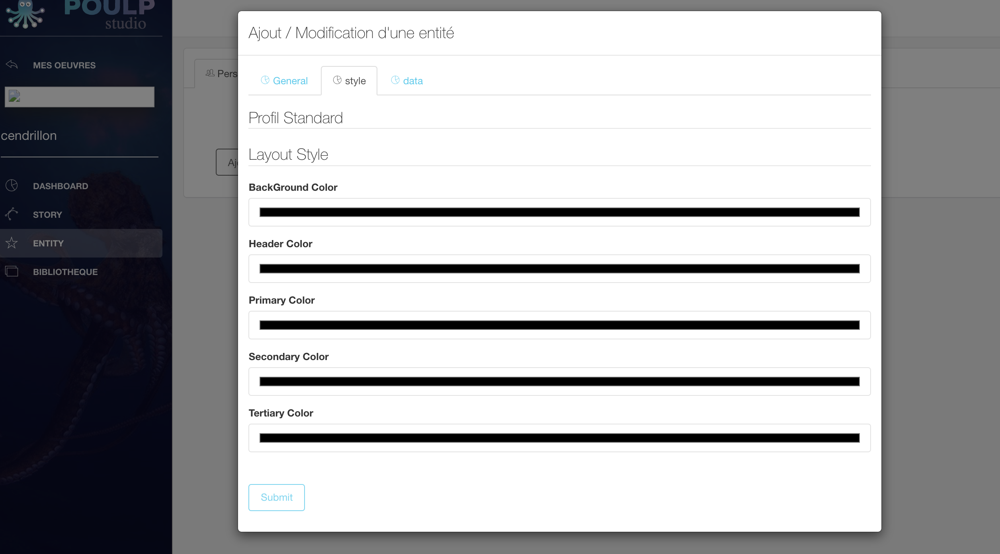
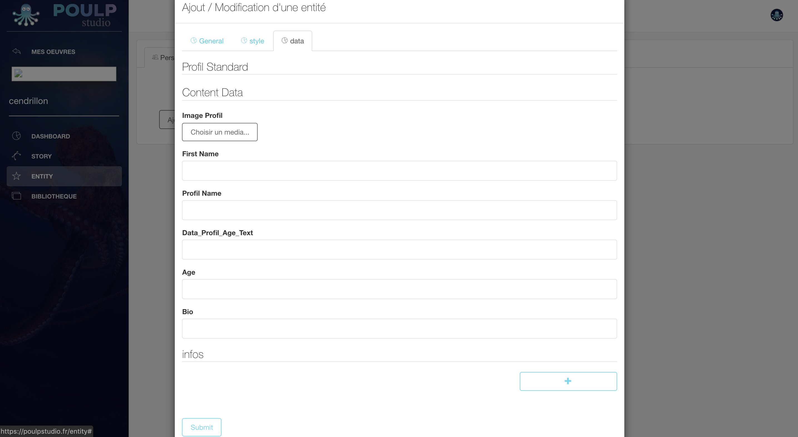

# Story

## Créer mon histoire - 3 vues 

### Créer mon chapitre

* ajouter un chapitre 
* conditionnalité 

### Créer ma séquence 

### Créer mon contenu 

* 
## Créer les entités fictives 

Dans la section **\[Entités\]** vous pouvez créez deux objets : un personnage ou une entités. Il suffit de cliquer sur l'un ou sur l'autre \(l'entité sélectionné est mise en avant\). 

### Personnage

Pour créer un personnage, cliquer sur **\[Personnage\]** puis, sur **\[Ajouter\]**.

Vous accéder ensuite à la fenêtre d'édition pour créer votre personnage. Il suffit de renseigner les champs d'information requis  - dans la section  **\[Général\]** - comme illustré ci-dessous.

#### Général

Le choix du template détermine le style. Il faut donc définir en amont si le Personnage mis en jeu est statué selon une identité professionnelle ou personnelle. 

Si le template sélectionné est **\[Personnel\]**, ****alors les styles ****définis par défaut seront **\[Profil Standard\]** ou **\[Profil Complet\]**

Si le template sélectionné est **\[Professionel\]**, ****alors les styles ****définis par défaut seront **\[Profil pro complet\]** ou **\[Profil Pro Complet\]**

Dès que vous sélectionnez un template, deux sections apparaissent au-dessus de cette fenêtre d'édition : \[style\] et \[data\]

####  **Style**

#### **Data**

#### Entités 

## Structure arborescente 

### Trois strates

### Conditionnalités

### Bonus

### Notifiction 

### Visibilité parcours de lecture

### Choix multiples

## Parcours de lecture 

### Contenu 

### Discussion instantanée

#### Discussion instantanée 1 by 1

Vous l'aurez peut-être remarqué mais nous parlons de "1 by 1" et non de "1 to 1". Dans un contexte de fiction, le lecteur/joueur ne peut intervenir comme bon lui semble, des règles sont fixées ce qui cadre l'expérience de lecture. 

#### Discussion instantanée de groupe 

