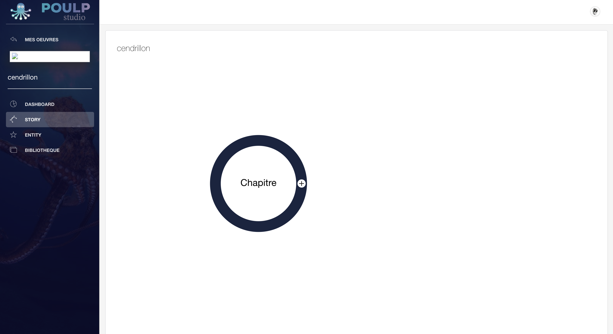
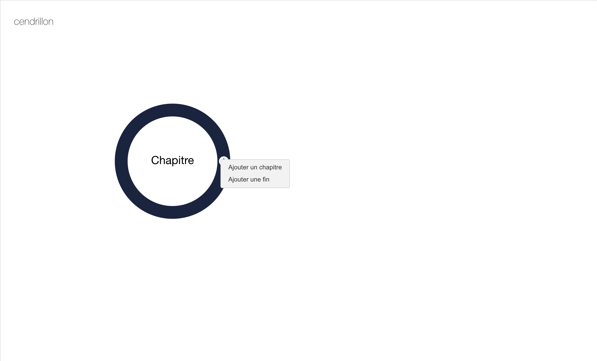
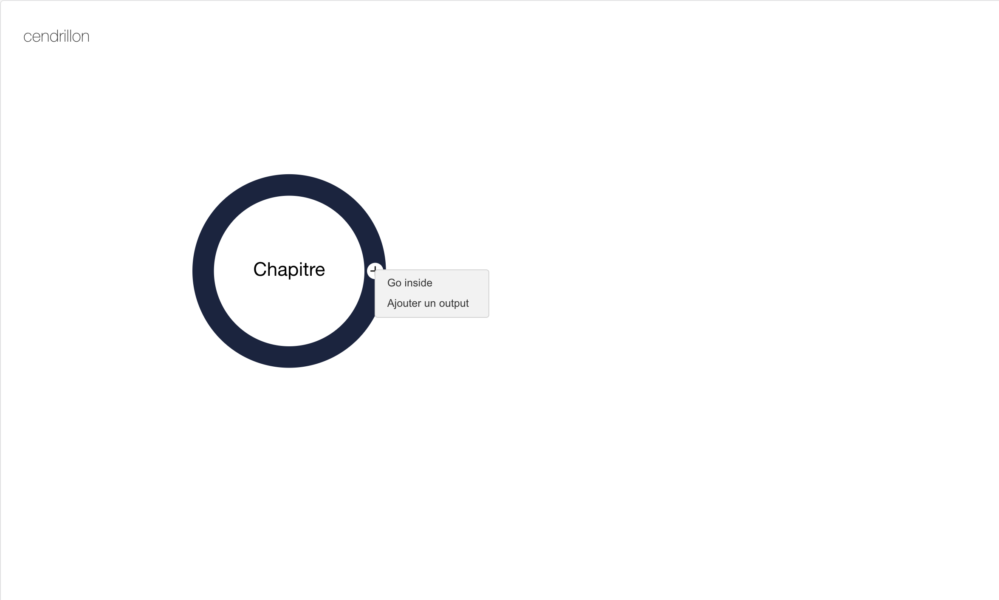
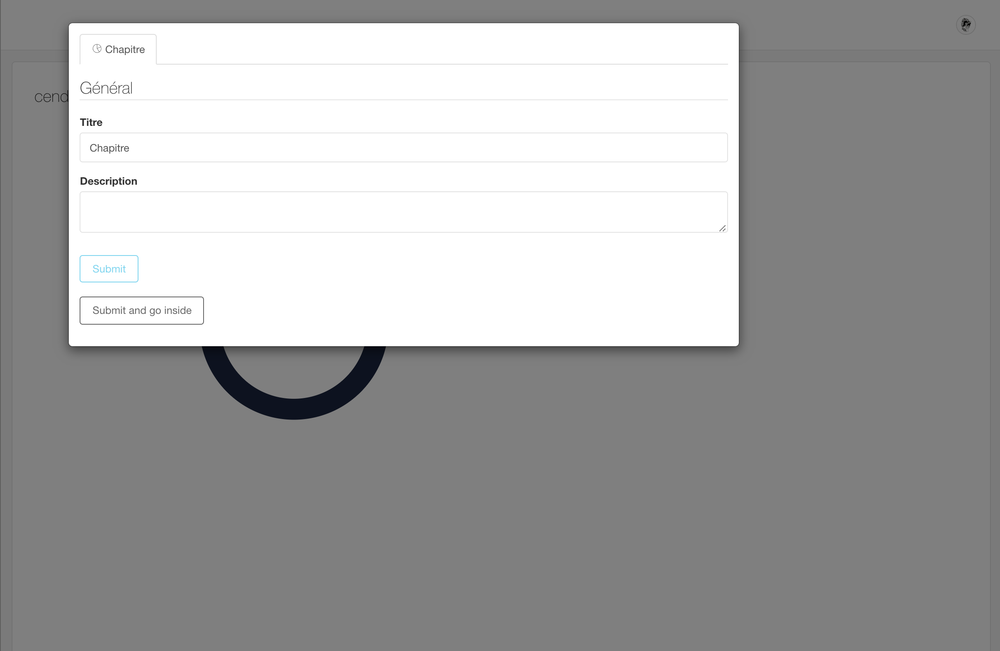
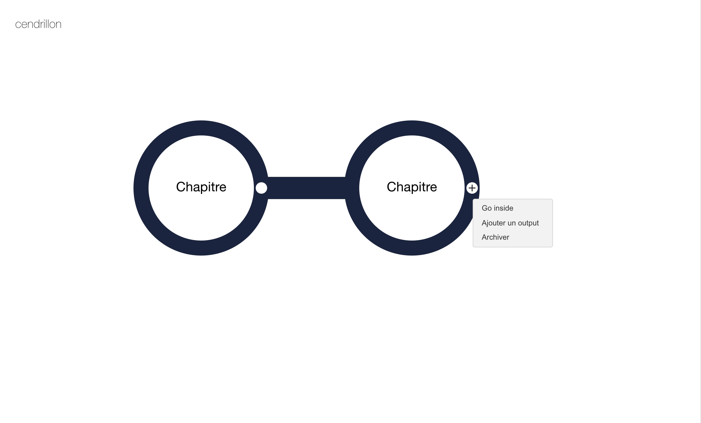
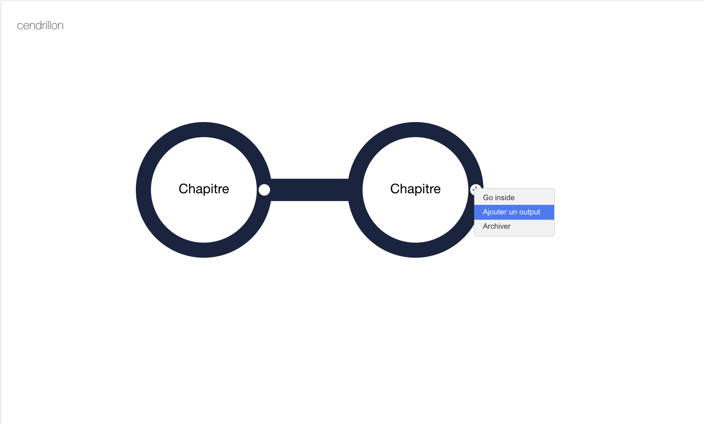
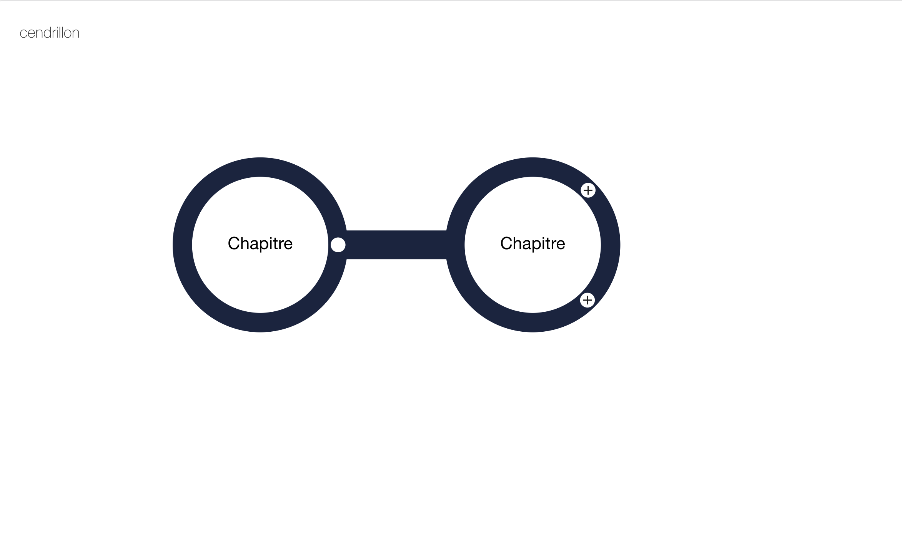

# Story

## Créer mon histoire - 3 vues 

Pour créer une smartfiction, la brigade du Poulp a pris le parti pris de vous offrir un espace d'édition selon  une structure arbores

### Créer mon chapitre

Clic Gauche 

Clic droit

* ajouter un chapitre 
* conditionnalité 

### Créer ma séquence 

### Créer mon contenu 

* 
## Créer les entités fictives 

Dans la section **\[Entités\]** vous pouvez créez deux objets : un **personnage** ou une **entité**. Il suffit de cliquer sur l'onglet **\[Personnage\]** ou **\[Entités\]** \(l'entité sélectionné est mise en avant\) pour accéder au formulaire d'édition. 

### Personnage

Pour créer un personnage, cliquer sur **\[Personnage\]** puis, sur **\[Ajouter\]**.

![capture d&apos;&#xE9;cran de la pr&#xE9;-s&#xE9;lection \[Personnage\]](.gitbook/assets/capture-de-cran-2019-06-17-a-17.12.19.png)

Vous accédez ensuite à la fenêtre d'édition pour créer votre personnage. Il suffit de renseigner les champs d'information requis  - dans la section  **\[Général\]** - comme illustré ci-dessous.

#### Général

![capture d&apos;&#xE9;cran de la fen&#xEA;tre d&apos;&#xE9;dition \[G&#xE9;n&#xE9;ral\] pour \[Personnages\]](.gitbook/assets/capture-de-cran-2019-06-17-a-17.12.30.png)

Le choix du template détermine le style. Il faut donc définir en amont si le **Personnage** mis en jeu est statué selon une identité professionnelle ou personnelle. 

![Capture d&apos;&#xE9;cran pour la pr&#xE9;s&#xE9;lection de la nature identitaire du \[Personnage\] - perso ou pro](.gitbook/assets/capture-de-cran-2019-06-17-a-17.12.38.png)

Si le template sélectionné est **\[Personnel\]**, ****alors les styles ****définis par défaut seront **\[Profil Standard\]** ou **\[Profil Complet\]**

![Deux styles sont propos&#xE9;s selon le template \[Personnel\]](.gitbook/assets/capture-de-cran-2019-06-17-a-17.13.06.png)

Si le template sélectionné est **\[Professionel\]**, ****alors les styles ****définis par défaut seront **\[Profil pro complet\]** ou **\[Profil Pro Complet\]**

![Deux styles sont propos&#xE9;s selon le template \[Professionel\]](.gitbook/assets/capture-de-cran-2019-06-17-a-17.12.57.png)

Dès que vous sélectionnez un template, deux sections apparaissent au-dessus de cette fenêtre d'édition : **\[style\]** et **\[data\]**

Une fois la section **\[Général\]** complétée, validez  l'ensemble des champs d'informations en cliquant sur **\[Submit\]**.

####  **Style**

Dans la fenêtre d'édition **\[style\]**, ****vous pouvez modifier les couleurs du _template_ comme illustré ci-dessous.

![capture d&apos;&#xE9;cran de la fen&#xEA;tre d&apos;&#xE9;dition \[style\] pour la section \[Personnage\]](.gitbook/assets/capture-de-cran-2019-06-17-a-17.26.35.png)

#### **Data**

![capture de la fen&#xEA;tre d&apos;&#xE9;dition de \[Data\] pour la section \[Personnage\]](.gitbook/assets/capture-de-cran-2019-06-17-a-17.26.49.png)

### Entités 

Pour créer un personnage, cliquer sur **\[Entités\]** puis, sur **\[Ajouter\]**

![capture d&apos;&#xE9;cran de la pr&#xE9;-s&#xE9;lection \[Entit&#xE9;s\]](.gitbook/assets/capture-de-cran-2019-06-17-a-17.35.24.png)

Vous accéder ensuite à la fenêtre d'édition pour créer votre personnage. Il suffit de renseigner les champs d'information requis  - dans la section  **\[Général\]** - comme illustré ci-dessous.

#### Général

![capture d&apos;&#xE9;cran de la fen&#xEA;tre d&apos;&#xE9;dition \[G&#xE9;n&#xE9;ral\] pour \[Entit&#xE9;s\]](.gitbook/assets/capture-de-cran-2019-06-17-a-17.35.45.png)

Le choix du template détermine le style. Il faut donc définir la nature de l'entité via la section **\[template\]** en définissant si elle l'entité est "objet" ou "potion".

![Capture d&apos;&#xE9;cran pour la pr&#xE9;s&#xE9;lection de la nature de l&apos;\[Entit&#xE9;\] - \[Objet\] ou \[Potion\]](.gitbook/assets/capture-de-cran-2019-06-17-a-17.36.05.png)

Si l'entité est "objet" alors le style à définir sera : 

![Deux styles sont propos&#xE9;s selon le template \[Objet\]](.gitbook/assets/capture-de-cran-2019-06-17-a-17.36.29.png)

Si l'"entité" est potion alors le style à définir sera : 

![Deux styles sont propos&#xE9;s selon le template \[Potion\]](.gitbook/assets/capture-de-cran-2019-06-17-a-17.36.16.png)

Dès que vous sélectionnez un template, deux sections apparaissent au-dessus de cette fenêtre d'édition : **\[style\]** et **\[data\].**

Une fois la section **\[Général\]** complétée, validez  l'ensemble des champs d'informations en cliquant sur **\[Submit\]**.

#### Style 

![capture d&apos;&#xE9;cran de la fen&#xEA;tre d&apos;&#xE9;dition \[style\] pour la section \[Entit&#xE9;s\]](.gitbook/assets/capture-de-cran-2019-06-17-a-17.41.27.png)

La section **\[Style\]** permet de définir les couleurs. Une fois définie, cliquer sur **\[Submit\]** pour valider.  

#### Data

![capture d&apos;&#xE9;cran de la fen&#xEA;tre d&apos;&#xE9;dition \[style\] pour la section \[Data\]](.gitbook/assets/capture-de-cran-2019-06-17-a-17.41.40.png)

La section **\[Data\]** permet de définir les données. Une fois définie, cliquer sur **\[Submit\]** pour valider.  

## Structure arborescente 

### Trois strates

### Conditionnalités

### Bonus

### Notifiction 

### Visibilité parcours de lecture

### Choix multiples

## Parcours de lecture 

### Contenu 

### Discussion instantanée

#### Discussion instantanée 1 by 1

Vous l'aurez peut-être remarqué mais nous parlons de "1 by 1" et non de "1 to 1". Dans un contexte de fiction, le lecteur/joueur ne peut intervenir comme bon lui semble, des règles sont fixées ce qui cadre l'expérience de lecture. 

#### Discussion instantanée de groupe 

